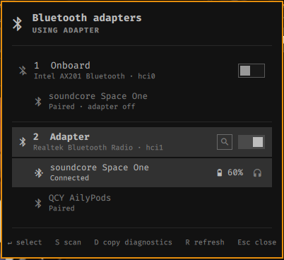
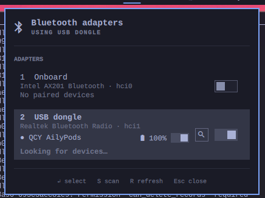

# Bluetooth Adapter Switch

An [Omarchy](https://omarchy.org/) bar widget for machines with two Bluetooth
adapters, typically the onboard chip plus a USB dongle. It keeps **exactly one
adapter active**, switches on its own when you plug or unplug the dongle, and
gives you a panel to manage the devices of each adapter: connect, pair, forget,
see the battery, and have the sound follow the headset.



## Contents

- [Features](#features)
- [Install](#install) · [Remove](#remove)
- [Settings](#settings)
- [Command line](#command-line)
- [How it works](#how-it-works)
- [Troubleshooting](#troubleshooting)
- [Dependencies](#dependencies)

## Features

### 1. One adapter at a time, chosen automatically

Two active adapters fight over the same devices, so the plugin keeps a single
one on:

- **Plug the dongle in** and it becomes the active adapter; the onboard chip is
  turned off.
- **Unplug it** and the onboard adapter comes back on.
- **At login**, if zero or several adapters are on, it settles on one.
- **Turned Bluetooth off on purpose** (the rfkill key, `bluetoothctl power off`)?
  By default one adapter is switched back on. Set `keepOneOn` to `false` to
  leave it off; the plugin then only steps in when several adapters are on.
- **A failed attempt is not retried in a loop:** after the automatic correction
  fails (an adapter that is hard-blocked, for example) it waits a minute before
  trying again.
- **Anything that turns a second adapter on** (another Bluetooth tool, for
  example) is corrected on the next read, within a few seconds.

Prefer the onboard chip? Set `preferred` to `Onboard` (see [Settings](#settings)).
A manual pick from the panel is respected until the set of adapters changes
again. Plug and unplug are noticed through `rfkill event`, so the reaction is
immediate rather than waiting for the next poll.

### 2. The bar widget


By default the bar shows only the Bluetooth icon: it is dimmed when there is
nothing to switch, a spinner while a switch is in progress, and crossed out when
no adapter is on. Hover for the current state, click for the panel. Turn on
`showLabel` to add a text label that says which adapter is active: `USB` (a removable dongle), `Onboard`
(a fixed chip), the raw `hci0`/`hci1` when two adapters are of the same type or
when `labelMode` is `Adapter id`, `off` when none is on, and `…` while a switch
is in progress (the icon turns into a spinner too). On a vertical bar only the
icon is shown. With a single adapter the widget is dimmed and there is nothing
to switch.

| Action | Result |
|---|---|
| Left click | Open the panel (or switch to the next adapter, see `clickAction`) |
| Scroll / middle click | Switch to the next adapter |
| Right click | Go back to the automatic choice (the preferred adapter) |
| Hover | Tooltip: every adapter with its type, `hciN` and state (`●` on, `○` off), the battery of connected devices, and a reminder of the clicks |

### 3. The adapter panel

Every adapter is a row with its **type** (Onboard / USB dongle), its **model**
(read from the USB database, for example `Intel AX201 Bluetooth`), its `hciN` and
the devices paired to it. Each row has a **switch**:

- turning an adapter **on** makes it the only one in use and turns the other off;
- turning the **active** one off hands over to the other adapter, so you are
  never left with nothing;
- with a single adapter the switch is disabled and says so.

Pointing at an adapter that is off shows, in red, which connected devices the
switch would drop (`Disconnects QCY AilyPods`), so a switch is never a surprise.
While switching, the switch shows a busy state and the header reads *Switching
adapter…*.

### 4. Devices: connect, battery, forget

Paired devices are listed under the adapter they belong to.

- **Connect / disconnect** with the device's switch (or by clicking the line).
  The switch is disabled on an adapter that is off, with a tooltip saying to
  switch to it first. A connect that gets no answer is cancelled after 15
  seconds so the next attempt starts clean.
- **Battery** appears next to the name (icon and percentage) when the device
  reports one through BlueZ, turning red and bold at 20% or less. Connected
  devices' batteries are also listed in the bar tooltip. Many earbuds do not
  report a level over Bluetooth; in that case nothing is shown rather than a
  made-up value.
- **Forget** (the trash button, visible when you point at the line) unpairs the
  device **on that adapter**. It asks for a second click within four seconds,
  because unpairing means pairing again from scratch. It works for a device
  paired to either adapter, including one paired to both.
- **BLE only** marks a paired entry that has no audio or input profile (see
  [Troubleshooting](#troubleshooting)). Its switch is disabled, with a tooltip
  explaining why.

### 5. Scan and pair new devices



Press the magnifier on the active adapter (or `S`) to look for devices. Devices
in range that announce a real name appear under **Nearby**, strongest signal
first; the `+` button pairs, trusts and connects in one go.

- The scan is **classic Bluetooth by default**, which is what headsets and
  speakers use. Change `scanTransport` to `Low Energy` or `Both` for BLE-only
  gear such as some keyboards and mice.
- Audio devices are listed before BLE ones, and BLE entries are tagged `BLE`.
- Unnamed devices (just a MAC address) are hidden, and at most six are shown.
- The scan stops after 45 seconds, when you press the magnifier again, when you
  switch adapter, and when the panel closes.
- If the device disappears before you click `+` (headsets leave pairing mode
  after a minute or two), you get a clear message to put it in pairing mode and
  scan again.

### 6. Sound follows the headset

After a connect or a pair, the plugin waits (up to about eight seconds) for the
Bluetooth audio output to appear, makes it the default output and moves what is
playing to it, using Omarchy's own `omarchy-audio-output-set-default`. When the
headset disconnects, PipeWire falls back to the previous output. If no output
appears, the log says so.

### 7. Feedback and errors

- A **desktop notification** confirms each switch, connect, disconnect, pair and
  forget, each with its own headline and glyph (turn it off with `notify`). A
  switch also lists what is connected to the adapter now in use. A new toast
  replaces the previous one instead of stacking, and clicking it opens the
  panel. Failures are notified as critical, with the reason in the body.
- A **red banner in the panel** says what failed and with which device, for
  example *Could not connect to QCY AilyPods: no response from the device. Turn
  it on, bring it close and make sure no other device is connected to it*. It
  has a dismiss button, disappears by itself after 12 seconds, and points to the
  log for details.
- When a device pairs but the first connection fails, the banner says
  *Paired, but could not connect* and the reason, instead of reporting a failed
  pair.
- Specific hints cover a device that is out of range, a connection attempt that
  is still running, a device BlueZ no longer knows, and a Low Energy-only
  pairing that can never carry audio.

### 8. Logs for diagnosing problems

Every action (switch, connect, disconnect, pair, forget, scan, audio) is written
to `~/.local/state/omarchy-bluetooth-adapter-switch/plugin.log` with its command,
outcome and duration. When an action fails, the log also gets a snapshot to
diagnose it: the rfkill state, the adapters, every BlueZ property of the device
involved (paired, trusted, connected, UUIDs, signal…) and the latest
`bluetoothd` messages. Polling is not logged, and the file rotates at 256 KB,
keeping one previous copy. The log holds device addresses, so the folder and
file are readable by you only. The widget itself logs to the shell journal.

```bash
bash ~/.config/omarchy/plugins/io.github.cesarfilho.bluetooth-adapter-switch/bt-adapter.sh log 80
journalctl -b | grep bt-adapter-switch
```

### 9. Keyboard and keybinding

In the panel: `↑`/`↓` or `j`/`k` move, `Enter` selects, `1`-`9` pick an adapter
directly, `S` scans, `R` refreshes, `Tab` moves to the next bar panel and `Esc`
closes. The panel also answers to Omarchy's shell IPC, so you can bind it to a
key in Hyprland:

```bash
omarchy-shell io.github.cesarfilho.bluetooth-adapter-switch toggle
```

(`open`, `close`, `show` and `hide` work too.)

## Install

```bash
omarchy plugin add https://github.com/cesarfilho/omarchy-bluetooth-adapter-switch.git --enable
```

Or by hand: clone this repository into
`~/.config/omarchy/plugins/io.github.cesarfilho.bluetooth-adapter-switch/`,
then run `omarchy-shell shell rescanPlugins` and
`omarchy plugin enable io.github.cesarfilho.bluetooth-adapter-switch`.

After updating the plugin, run `omarchy restart shell`: the running shell keeps
the old widget in memory until it restarts.

Move it with `omarchy bar move io.github.cesarfilho.bluetooth-adapter-switch --section left`.

## Remove

```bash
omarchy plugin remove io.github.cesarfilho.bluetooth-adapter-switch
```

If an adapter is still blocked, unblock it first with `rfkill unblock bluetooth`.
The log in `~/.local/state/omarchy-bluetooth-adapter-switch/` can be deleted.

## Settings

Set in the widget's entry in `~/.config/omarchy/shell.json`, or from the
Omarchy settings panel:

| Key | Default | Meaning |
|---|---|---|
| `showLabel` | `false` | Show the adapter name next to the icon (the bar shows only the icon by default) |
| `preferred` | `USB dongle` | Which adapter is active when several are present: `USB dongle` or `Onboard` |
| `labelMode` | `Type` | `Type` shows USB / Onboard, `Adapter id` shows hci0 / hci1 |
| `clickAction` | `Open panel` | `Open panel` or `Switch to next` on left click |
| `scanTransport` | `Classic (headsets, speakers)` | What a scan looks for: `Classic`, `Low Energy` or `Both` |
| `keepOneOn` | `true` | Switch an adapter back on when all of them are off; `false` lets you turn Bluetooth off completely |
| `notify` | `true` | Desktop notification after each action |
| `refreshIntervalSec` | `10` | How often the state is re-read (2 to 120); 2 s while the panel is open |

## Command line

Everything the widget does goes through [`bt-adapter.sh`](bt-adapter.sh), which
you can also run by hand:

| Command | What it does |
|---|---|
| `status` | One line per adapter: `hciN\|ADDRESS\|ALIAS\|powered\|blocked` |
| `json` | Full state as JSON: type, model, paired devices with battery, nearby devices |
| `use <hciN>` | Make that adapter the only active one |
| `next` | Make the next adapter the active one |
| `auto [usb\|onboard]` | Make the preferred adapter the only active one |
| `ensure [usb\|onboard]` | Like `auto`, but only when zero or several are active |
| `watch` | Print a line on every adapter plug, unplug or state change |
| `connect` / `disconnect <hciN> <ADDRESS>` | Connect or disconnect a paired device (connect also moves the sound) |
| `pair <hciN> <ADDRESS>` | Pair, trust and connect a device |
| `forget <hciN> <ADDRESS>` | Unpair a device from that adapter |
| `scan <hciN> [seconds] [bredr\|le\|auto]` | Look for devices until stopped (default 45 s, classic) |
| `audio <ADDRESS>` | Make a connected device the default audio output |
| `log [lines]` | Show the end of the plugin log |

## How it works

Switching to an adapter powers it on and soft-blocks every other Bluetooth
adapter with `rfkill`. Everything runs with your own user's permissions:
`/dev/rfkill` is writable by the logged-in user through the logind ACL, and
BlueZ accepts property changes from an active session. The plugin needs no
elevated rights, installs no system files and does not touch anything outside
its own directory (apart from its log).

Because the block is an rfkill soft block, `systemd-rfkill` restores it at boot,
so your choice survives a reboot. The target adapter is powered on first, with
retries because BlueZ takes a moment to accept `Powered` after an unblock, and
the others are only turned off once it is up. A failed switch therefore never
leaves you with no adapter.

Adapter type comes from sysfs: a USB device flagged `fixed` is reported as
onboard, a `removable` one as a USB dongle. Device actions call BlueZ directly
(`Device1.Connect`, `Adapter1.RemoveDevice`, …) on the adapter that owns the
device. That is deliberate: `bluetoothctl` and the stock Bluetooth widget only
address the default adapter, so they cannot see or forget a pairing that lives on
the other one. Scanning keeps a `bluetoothctl` session open on the chosen adapter,
because BlueZ stops a discovery when the process that asked for it exits.

## Troubleshooting

- **A headset is paired but will not connect** (*no response*, or
  `le-connection-abort-by-local` in the log). It was probably paired over Low
  Energy, which leaves an entry with no audio profile. Some earbuds (QCY, for
  example) even show up twice: an audio identity and a separate "app" identity
  that only speaks Low Energy. Forget the entry tagged **BLE only**, put the
  headset in pairing mode and scan again with the default classic scan.
- **Connected, but the sound still comes out of the speakers.** The plugin moves
  the sound for you on connect. If it did not, run `bt-adapter.sh audio
  <ADDRESS>` and check the log for *no sink appeared* (the headset may be on a
  call profile).
- **Two adapters are on.** Something else turned the second one on (the stock
  Bluetooth widget unblocks every adapter when you act on a device through it).
  The plugin notices and puts it back to one within a few seconds; use the
  panel for device actions to avoid it.
- **The widget does not reflect an update.** Run `omarchy restart shell`.
- **No battery shown.** The device does not report one over Bluetooth.
- **Something failed and the banner is gone.** Read the log, see
  [Logs](#8-logs-for-diagnosing-problems).

## Development

`tests/test.sh` checks the logic that does not need hardware (the JSON the
widget reads, the adapter-info cache, the log permissions and the mapping of
BlueZ errors to messages) with `rfkill`, `busctl` and sysfs replaced by stubs.
CI runs it together with ShellCheck and `.github/scripts/validate.sh`.

```bash
tests/test.sh
.github/scripts/validate.sh
```

## Dependencies

All are present on a standard Omarchy install: `bluez` and `bluez-utils`
(BlueZ over D-Bus, `bluetoothctl` for scanning), `util-linux` (`rfkill`),
`systemd` (`busctl`, `udevadm`), Omarchy's `omarchy-notification-send`, `jq`, `bash`, and
`pipewire-pulse` (`pactl`) and `wireplumber` (`wpctl`) for the audio output.

## License

[MIT](LICENSE)
